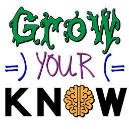



## Who the Heck is Joe?

Joseph Hall has been a professional software developer for more than 25 years. He worked as a programmer for Microsoft and IBM, he was the software architect for a Fortune 500 bank, he was the CTO of an online ticket sales and servicing company, and he started his own consulting company (Codetopia, LLC) in 2006.

Joe makes his living writing desktop, web, and mobile device applications for businesses and governmental agencies, but game programming is his passion, and it was gaming that got him into programming in the first place. He was a member of the original Xbox team and he joined the Visual Studio .NET team just after the Xbox was released in 2001.

He is the author of *<a href="http://amzn.to/1JuxvD8" target="_blank">XNA Game Studio Express: Developing Games for Windows and the Xbox 360</a>*, which was published in 2007, and *Fauxcabulary: Fake Definitions, Real Funny*, which was self-published in 2015 (for <a href="https://leanpub.com/fauxcabulary" target="_blank">eBook</a> and <a href="http://www.lulu.com/shop/http://www.lulu.com/shop/joseph-hall/fauxcabulary/paperback/product-22179468.html" target="_blank">print</a>). He has several new books in the pipeline including a multi-volume series on MonoGame development using Xamarin Studio and a techno-thriller trilogy set in the not-so-distant future.

Joe lives with his wife and three daughters in Montgomery, Alabama. Every summer, Joe teaches high school students how to write games during an intense weeklong course in North Carolina for Landry Academy. In his free time, Joe dabbles in sketching, cartooning, and creating 3D models. When you see his artistic creations, you'll understand why he makes his living as a programmer.

## What's GrowYourKnow?

First and foremost, GrowYourKnow is intended to be a hub for educational games and interactive learning. Targeted at K-through-12 students in public schools, private schools, and homeschools, GrowYourKnow was created to improve the quality and selection of edutainment applications.

As time allows, I plan to use this site to showcase works-in-progress and proofs-of-concept. But, my ultimate goal is to have high-quality, packaged software with features such as:

* Interactive and engaging content, targeting a variety of age groups, in a variety of subject areas.
* Built-in analytics to track the progress of students.
* Customizable reports for parents to track activity and progress.
* State-specific forms and reports for homeschool families.

My desire was sparked when I visited a few homeschool conventions with my wife. I was generally underwhelmed by the offerings, finding the ocasional jewel amongst the debris. I felt like I had the professional and expert contacts in education circles, the technical know-how, and the design experience to do better. (Even though the doodle to the right may indicate otherwise.)

